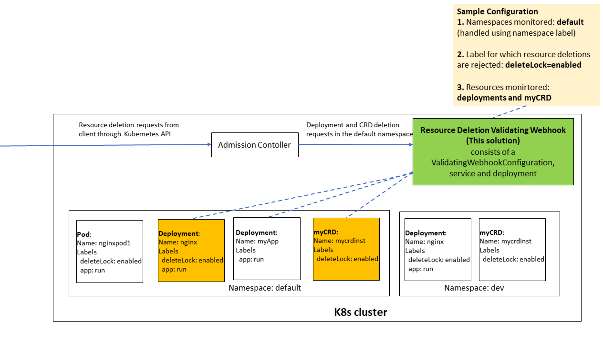

# Kubernetes resource deletion validation webhook
AdmissionControl validating webhook to block deletion of resources based on resource labels.

## What this solution does
For Configured Kubernetes namespaces and resources (deployments, crds etc) deletion requests are first processed by this webhook, and based on labels associated with the resource the resource deletion requests (kubectl delete resource .) are either rejected or allowed. The label keys and values for which resource deletion requests are rejected can also be configured.

## Solution Components

* In the above diagram the validating webhook has been configured to monitor **deployments** and **myCRDs** in the **default** namespace
* So if deletion request for all 6 resources shown in the diagram above are made to the kubernetes API, the requests for the 2 deployments and myCRD resource in the default namespace will be forwarded to our webhook. 
* Since the webhook has been configured to reject resource deletion requests where resources have a label **deleteLock=enabled** the deletion requests for the deployment and myCRD highlighted in orange will be rejected.  

## Key Functions of webhook implementation

## Installation / deployment

## Configuring the namespaces, resources and labels
